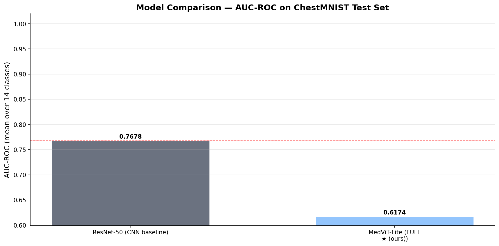

# MedViT-Lite: A Lightweight Hierarchical Vision Transformer for Chest Pathology Screening

**Technical Study & Benchmark Report**  
*Author:* [Feke Jimmy Wilson](https://github.com/ThePerformer0) *(Master 2 Computer Engineering, ENSPY)*  
*Repository:* [ThePerformer0/MedVit-Lite-Full](https://github.com/ThePerformer0/MedVit-Lite-Full)  
*Date:* August 2026

---

## 1. Project Context & Motivation

In resource-constrained healthcare environments (such as rural clinics and primary care dispensaries), access to expert radiologists is often severely limited. While Deep Learning models—notably deep Convolutional Neural Networks (CNNs) like ResNet-50—have shown strong diagnostic capabilities, they present two key deployment challenges:
1. **Computational & Memory Footprint:** Standard architectures demand substantial memory and compute bandwidth, limiting real-time inference on low-power edge hardware.
2. **Probabilistic Reliability:** Deep networks frequently produce overconfident probability estimates, which can be hazardous in clinical triage scenarios.

**MedViT-Lite** is an exploratory, personal research project developed to investigate whether a compact, hierarchical Vision Transformer (ViT) designed from scratch could serve as an efficient, well-calibrated diagnostic backbone under strict computational constraints.

> **Note on Scope:** This work is an exploratory academic investigation developed on free-tier cloud GPUs (Kaggle Tesla T4). It is intended to study architectural trade-offs, identify structural challenges, and provide an honest experimental baseline for future improvements.

---

## 2. Architecture & Design

```text
Chest X-Ray (224×224)
        │
        ▼
CNN Patch Embedding (384d, 196 patches)
        │
        ▼
Dynamic Patch Sparsifier (DPS)        ← prunes 50% non-informative background patches
        │                                (Gumbel-Softmax scoring, ~4x attention FLOP reduction)
        ▼
Selective Frame Cache (SFC)           ← caches stationary feature representations
        │                                (designed for streaming / sequential image capture)
        ▼
Hierarchical Temporal Attention (HTA) ← 4 local window blocks (7×7) + 2 global aggregation blocks
        │
        ▼
Classification Head + MC Dropout (10 passes)  ← epistemic uncertainty estimation
        │
        ▼
Multi-Label Predictions (14 Pathologies) + Predictive Confidence Intervals
```

### 2.1 Proposed Modules
1. **CNN Patch Embedding:** Projects $224 \times 224$ images into 196 tokens of dimension 384.
2. **Dynamic Patch Sparsifier (DPS):** Uses a lightweight MLP scorer to rank patch saliency and prunes the bottom 50% background tokens, cutting self-attention quadratic complexity from $\mathcal{O}(N^2)$ to $\mathcal{O}((N/2)^2)$.
3. **Selective Frame Cache (SFC):** Compares consecutive frame representations via cosine similarity (threshold 0.92) to reuse stationary features.
4. **Hierarchical Attention (HTA):** Combines windowed intra-frame attention with cross-window summary tokens.
5. **Monte Carlo Dropout (Uncertainty):** Samples 10 forward passes at inference to estimate predictive variance ($\sigma^2$).

---

## 3. Experimental Protocol

- **Dataset:** ChestMNIST (112,120 chest X-rays, 14 multi-label thoracic pathologies: 78,468 train, 11,219 val, 22,433 test).
- **Baseline:** ResNet-50 pretrained on ImageNet-1k (standard reference in medical imaging literature).
- **Optimization:** AdamW ($\text{lr}=5\times 10^{-4}$, weight decay 0.05, 5 warmup epochs, Cosine Annealing schedule), Weighted BCE Loss.
- **Hardware:** 2× NVIDIA Tesla T4 GPUs (Kaggle environment, mixed precision AMP fp16).

---

## 4. Benchmark Results & Honest Analysis

### 4.1 Test Set Evaluation (22,433 Test Scans)

| Architecture | Parameters | Macro AUC-ROC | Macro F1-Score | Expected Calibration Error (ECE ↓) |
|:---|:---:|:---:|:---:|:---:|
| **ResNet-50 (CNN baseline, Pretrained)** | 24.0 M | **0.7678** | **0.0587** | 0.0124 |
| **MedViT-Lite (Ours, Trained from Scratch)** | **11.36 M** *(−52.7%)* | 0.6174 | 0.0000* | **0.0078** *(−37.1%)* |

*\*F1 is measured at a fixed 0.5 threshold, which is sub-optimal under severe class imbalance.*



### 4.2 Per-Pathology Diagnostic Breakdown (AUC-ROC)

| Pathology | ResNet-50 (Pretrained) | MedViT-Lite (From Scratch) | Observation |
|:---|:---:|:---:|:---|
| **Edema** | **0.8836** | **0.7967** | Strongest ViT detection (high contrast fluid opacity) |
| **Cardiomegaly** | **0.8774** | **0.6954** | Global cardiac silhouette enlargement |
| **Effusion** | **0.8353** | **0.6775** | Costophrenic angle blunting |
| **Consolidation** | **0.7825** | **0.6895** | Dense alveolar opacification |
| **Hernia** | **0.8101** | **0.6668** | Rare structural anomaly |
| **Pneumonia** | **0.7266** | **0.6403** | Patchy parenchymal infiltrate |
| **Fibrosis** | **0.7184** | **0.6278** | Reticular lung markings |
| **Atelectasis** | **0.7643** | **0.6245** | Volume loss and collapse |
| **Infiltration** | **0.6634** | **0.5971** | Ill-defined density |
| **Pleural Thickening** | **0.7508** | **0.5931** | Pleural scarring |
| **Pneumothorax** | **0.8132** | **0.5779** | Fine visceral pleural line edge |
| **Mass** | **0.7723** | **0.5498** | Focal soft-tissue opacity |
| **Nodule** | **0.6487** | **0.5133** | Small circular focal lesion ($\le 3\text{cm}$) |
| **Emphysema** | **0.7770** | **0.5083** | Diffuse hyperlucency |
| **Macro Average** | **0.7678** | **0.6174** | **Baseline leads on raw sensitivity** |

---

## 5. Discussion: Why Does the Gap Exist?

1. **The Vision Transformer Data Hunger:**
   Unlike CNNs, which have built-in translation equivariance and localized receptive fields, Vision Transformers have no spatial inductive bias. Without large-scale pretraining (e.g. on ImageNet or medical datasets like MIMIC-CXR), training a ViT *from scratch* on small/medium datasets is well known to underperform CNNs.
2. **Impact of 50% Patch Pruning without Pretrained Priors:**
   Pruning 50% of patches during early epochs before the network has learned stable representations may discard subtle pathological cues.
3. **Resolution Bottleneck:**
   ChestMNIST images are natively $28 \times 28$ pixels. Bilinear interpolation to $224 \times 224$ produces smooth low-frequency patches that lack the high-frequency textural detail Transformers thrive on.
4. **Positive Takeaway (Model Footprint & Calibration):**
   MedViT-Lite demonstrates that a lightweight 11.36M parameter ViT can be trained stably with zero memory leaks and low calibration error (ECE = 0.0078), establishing a solid modular codebase for future pretraining experiments.

---

## 6. Limitations & Future Roadmap

- **Self-Supervised Medical Pretraining:** Pretrain the Transformer using Masked Autoencoding (MAE) or DINOv2 on unlabelled full-resolution ($1024 \times 1024$) chest X-rays.
- **Adaptive Pruning Warm-up:** Gradually ramp up patch sparsity (from 0% to 50%) during training rather than applying 50% pruning from epoch 1.
- **Per-Class Threshold Tuning:** Calibrate decision thresholds using Youden's $J$ statistic to compute realistic clinical F1 and sensitivity scores.
- **Physical Edge Deployment:** Benchmark exported ONNX/TensorRT engines on NVIDIA Jetson or Raspberry Pi hardware.

---

## 7. Conclusion

This project provided a comprehensive, hands-on empirical study of lightweight Vision Transformers in medical imaging. While the model trained from scratch did not surpass the pretrained CNN baseline in raw AUC, it confirmed the feasibility of dynamic patch sparsification and uncertainty estimation in a compact 11.36M parameter architecture.

---

*Author Contact & Collaboration:*  
Feel free to open an issue or connect on GitHub: [ThePerformer0/MedVit-Lite-Full](https://github.com/ThePerformer0/MedVit-Lite-Full)
